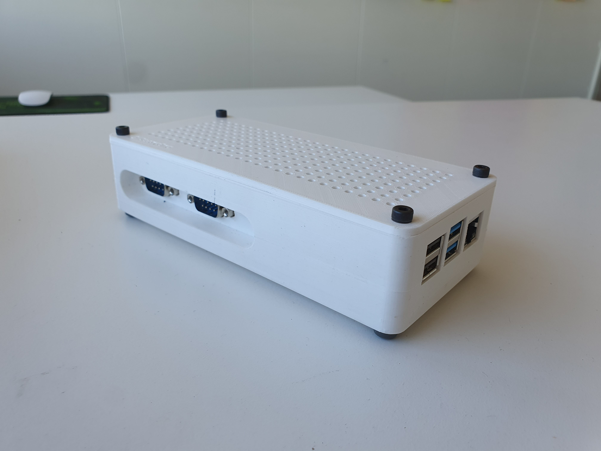
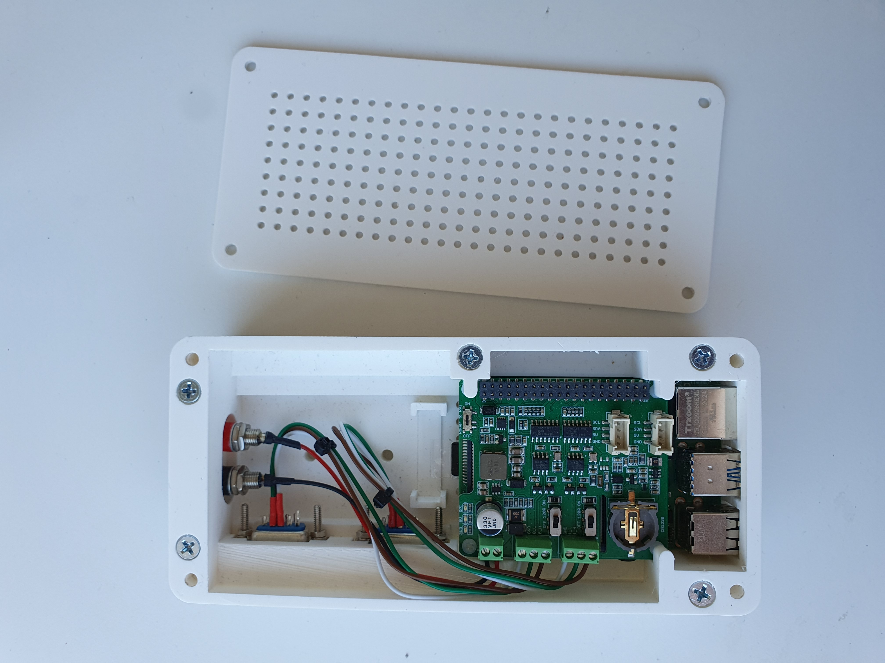

# Beamy One gallery

> The documentation in this folder is **deprecated**.
> 
> For the latest instructions go to a repository [remotivelabs/remotive-box](https://github.com/remotivelabs/remotive-box/).

---

Go [here](3D-model) to print your copy.

## Components

- Raspberry pi 4 (4GB)
- Seeed Studio [link](https://wiki.seeedstudio.com/2-Channel-CAN-BUS-FD-Shield-for-Raspberry-Pi/)

## Connectors (electrokit)

- D-SUB 9 pin, ref number 41000551
- Monteringssats 41011082 (D-SUB mountings)
- Banankontakt 41010873 (red)
- Banankontakt 41010870 (black)
- Gummifot 41001130 (rubberfoot)

> electrokit [link](https://www.electrokit.com/) 

## Gallery

