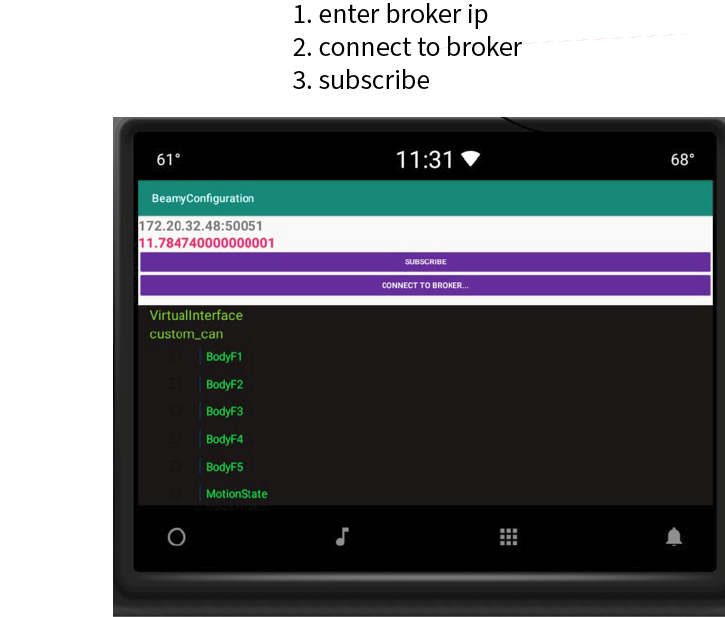

# Android gPRC example 

## Project Summary:
A Sample Android application that communicates with the Beamy broker. The
Android application retrieves current configuration information from the Beamy broker by calling the
proto defined SystemService:

```
...
service SystemService {
  rpc GetConfiguration (Empty) returns (Configuration) {}
  rpc ListSignals (NameSpace) returns (Frames) {}
}
...

```

It retrieves a list of vehicle network configurations that are available for a
vehicle.

## Introduction 
This application is using the io.grpc implementation: https://grpc.io/docs/tutorials/basic/android/
The Beamy proto files are stored in a folder under **src/main/proto** and the java generated files
are automatically built when syncing the project in android studio.

The project gradle file have the following dependencies added for grpc:
```
classpath 'com.google.protobuf:protobuf-gradle-plugin:0.8.16'
```

To the module gradle file we add at the top of the file.
```
apply plugin: 'com.google.protobuf'
```
 
The following takes care of the java proto generated files:
```
protobuf {
    protoc { artifact = 'com.google.protobuf:protoc:3.8.0' }
    plugins {
        javalite { artifact = "com.google.protobuf:protoc-gen-javalite:3.0.0" }
        grpc {
            artifact = 'io.grpc:protoc-gen-grpc-java:1.21.0' // CURRENT_GRPC_VERSION
        }
    }
    generateProtoTasks {
        all().each { task ->
            task.plugins {
                javalite {}
                grpc { // Options added to --grpc_out
                    option 'lite'
                }
            }
        }
    }
}


```

We also add these dependencies:

```
implementation 'io.grpc:grpc-okhttp:1.21.0' // CURRENT_GRPC_VERSION
implementation 'io.grpc:grpc-protobuf-lite:1.21.0' // CURRENT_GRPC_VERSION
implementation 'io.grpc:grpc-stub:1.21.0' // CURRENT_GRPC_VERSION
```
## Proto file settings
The proto files should be copied to */src/main/proto, and for the protogen to generate the service 
we need to edit in all of the proto files and add the following statement(s):

```
option java_generic_services = true;
```

To get a java qualified name we need to add these statements to our proto files -  in this case the 
**system_api.proto** - which then lets us interact with the Beamy broker server.
```
option java_package = "com.example.beamyconfiguration";
option java_outer_classname = "System";
```

like this:

```
...
SystemServiceGrpc.SystemServiceBlockingStub stub = SystemServiceGrpc.newBlockingStub(channel);
...
System.Configuration conf = stub.getConfiguration(request);
...

```


## Java protobuf call
To setup the connection with the signal broker we need to build a io.grpc.Managedchannel. Once the connection is established
we have basically two sets of services available a blocking service and a non-blocking when that makes sense. In this case
we use the blocking service call with an empty request to retrieve the vehicle configuration.

```
...
import io.grpc.ManagedChannelBuilder;
import io.grpc.ManagedChannel;
...
channel = ManagedChannelBuilder.forAddress("10.242.179.196",50051).usePlaintext().build();

SystemServiceGrpc.SystemServiceStub stub = SystemServiceGrpc.newStub(channel);
SystemServiceGrpc.SystemServiceBlockingStub stub = SystemServiceGrpc.newBlockingStub(channel);

Base.Empty request  = Base.Empty.newBuilder().build();
Base.Configuration conf = stub.getConfiguration(request);
...

```

## Subcribing to vehicle signals

Once we have the broker up and running we are able to subscribe to or publish values for individual signals such as vehicle speed. Once connected to the broker we need to identify the namespace from where the signals are coming - the upper nodes in the signal tree displayed in the tree view. Then we need to know the name of the actual signal we want to subscribe to.

```
stub = NetworkServiceGrpc.newBlockingStub(BrokerDataModel.channel);
// build a clientId, the broker uses this id for handling its clients
Base.ClientId clientId  = Base.ClientId.newBuilder().setId("android_client").build();
// build a namespace, e.g where does the signal you want originates
Base.NameSpace namespace = Base.NameSpace.newBuilder().setName("custom_can").build();
//build a signal id for a signal and tie the signal to its namespace
Base.SignalId sigId = Base.SignalId.newBuilder().setNamespace(namespace).setName("VehicleSpeed").build();

//build a list of signals to subscribe to
signalS = Network.SignalIds.newBuilder().addSignalId(sigId).build();
subConfig = Network.SubscriberConfig.newBuilder().setClientId(clientId).setSignals(signalS).build();

```

Here we are setting up subscribtion for vehicle speed.

```
java.util.Iterator<Network.Signals> response = stub.subscribeToSignals(subConfig);
...
Network.Signal aSignal = sigs.getSignal(i);
...
aSignal.getDouble();
```

Retrieving the signal value as a double. Use code completion in Android Studio to see different formats tailored for the specific signal which we are subscribing to - the sample application is listening tio VehicleSpeed.

# Application UI (android-sub branch)

Follow the instructions below to run the application. Use the broker web application at 8080 to run the playback setup to replay signals.


