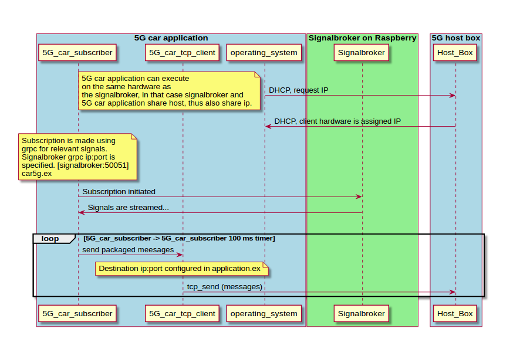

# Car5g

## Example application

The sample application subscribes to a few signals and dispatches them to a given server (some.host:2017) with a given time intrvall.
Subscription is done using gRPC to the sinalbroker. gRPC host address is "localhost:50051" which currently assumes that this app runs on them same machine as the signalbroker.

The subscribed signals are then dispatched every 100ms to `some_host:2017`.



## Installation, configuration

start the server and make sure it uses [configuration file:](config/interfaces.json)

## Running

Copy the car5g folder to the host and start the app from the car5g folder using

```elixir
iex -S mix
```
or
```elixir
mix run --no-halt
```

## Reference: generation of the ex files from the proto files:

from this folder
```bash
protoc -I ../../../../apps/grpc_service/proto_files/  --elixir_out=plugins=grpc:./lib/generated_proto_files ../../../../apps/grpc_service/proto_files/*.proto
```
